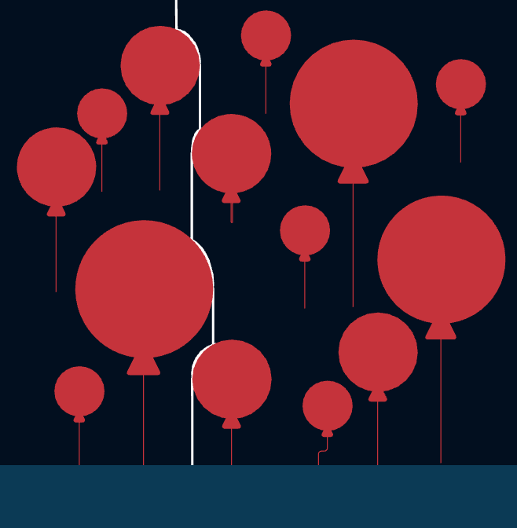

## Problem Statement

A group of children are being chased by Pennywise, and have been chased onto a bridge.
There are balloons filling the space beneath the bridge, and clowns closing in from either side of the bridge.
In order to safely get away, they will have to jump and slide between the balloons, finally landing safely in the river.

When they jump, they will fall straight down and then slide off each balloon they encounter, until they finally reach the river at height 0.
While sliding off each balloon, they slide along the slope of the spherical balloon, and then continue to fall directly downwards.
As the slope of each balloon is always directly away from the `(x, y)` coordinates of the center of the balloon, the angle of the person's `(x, y)` coordinates relative to the `(x, y)` coordinates of the center of the balloon stays constant as they are sliding, up until they are at the edge of the balloon.

If they jump from the bridge at position `(0, 0, 1500)`, where will they land?



## Interpreting the Input
The input consists of the number of balloons `n`, and then `n` lines each describing a balloon's `x` position, `y` position, `z` position, and radius.

```
n
x y z r <n lines of this form>
x y z r
```

## Output
Output the x and y values of the landing location, each rounded up to the next integer, separated by spaces.
```
x y
```

## Constraints
```
0 < h <= 1000
0 <= n <= 100
-100 <= x <= 100
-100 <= y <= 100
0 < r < 100
```
All values given will be integers.

At no point will someone fall directly in the center of the balloon.

No balloons will overlap with each other or the river.

The starting location will not have a balloon in it.

### Example Input #1:
```
4
0 1 70 2
0 -2 40 3
5 5 90 2
1 1 10 1
```

### Example Output #1:
```
0 1
```
The landing location is at `(0, 1)`. 

The highest balloon is at `(5, 5, 90)` with radius 2.
At height 90, they are falling at `(0, 0)`, which is more than 2 distance from `(5, 5)` and so this balloon does not affect them.

The next balloon is at `(0, 1, 70)` with radius 2.
At height 70, they are falling at `(0, 0)`, which is less than 2 distance from `(0, 1)`, so they slide along the curve of the balloon until they reach the edge at `(0, -1)`, before continuing to fall.

The next balloon is at `(0, -2, 40)` with radius 3.
They are still falling at `(0, -1)` which is less than 3 distance from `(0, -2)`, so they slide along the curve of the balloon until they reach the edge at `(0, 1)`, before continuing to fall.

The final balloon is at `(1, 1, 10)` with radius 1.
They are falling at `(0, 1)` which is exactly 1 distance from `(1, 1)`, and so they are not affected by the balloon.

Thus, the final falling location is `(0, 1)`.

### Example Input #2:
```
2
2 2 100 50
-30 -35 20 5
```

### Example Output #2:
```
-34 -32
```

The landing location is at `(-34, -32)`.

The first balloon is at `(2, 2, 100)` with a radius of 50.
They are falling at (0, 0), which is an angle of 225 degrees from the center of the balloon.
Thus, they slide until they are 50 units away from the center, still at an angle of 225 degrees, and end up at
`(-33.355, -33.355)`.

The second balloon is at `(-30, -35, 20)` with a radius of 5.
They are falling at `(-33.355, -33.355)`, which is an angle of 153.88 degrees from the center of the balloon, and less than 5 distance from the center of the balloon.
Thus, they slide until they are 5 units away from the center, still at an angle of 153.88 degrees, and they end up at `(-34.489, -32.800)`.

Rounding up to the next integer, the final landing location is `-34, -32`.

